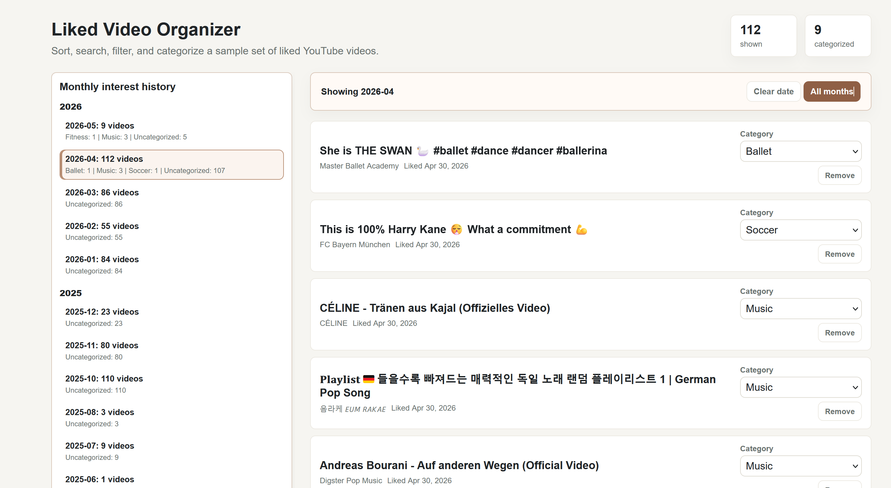
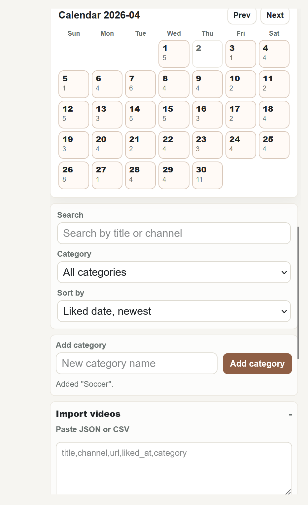
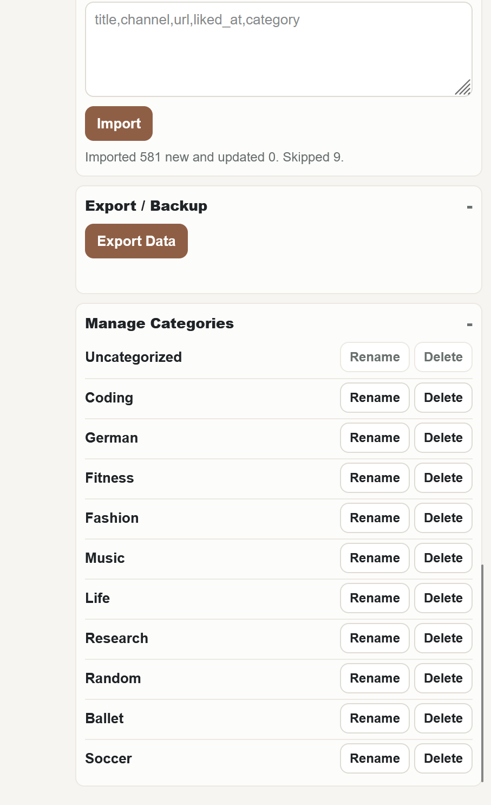

# YouTube Liked Video Organizer

Organize your YouTube liked videos with:
- categories
- calendar view
- monthly history
- import/export (JSON/CSV)
- Chrome extension export

## Features
- Import YouTube liked videos
- Categorize and filter
- Calendar-based viewing
- Local storage (no backend)

## Usage
Open `index.html` in your browser. The app stores your videos and categories in `localStorage`, so there is no backend or account setup.

### Chrome Extension Workflow
1. Open the YouTube / Google Activity page that shows your liked video activity.
2. Scroll the activity page first to load more liked activity items.
3. Click the Chrome extension.
4. Choose either:
   - `Export visible liked videos` for only the currently loaded visible items.
   - `Auto-scroll and export` to let the extension scroll, load more items, then export.
5. The extension downloads a JSON file.
6. Open the app.
7. Expand `Import videos`.
8. Paste or drag the exported JSON into the import box.
9. Click `Import`.
10. Use search, filters, calendar, history, and categories to organize the imported videos.

### Manual Import
You can also paste JSON or CSV directly into the app import box.

Required fields:
- `title`
- `channel`
- `url`
- `liked_at`

Optional field:
- `category`

### Limitation
The extractor depends on the YouTube / Google Activity page DOM. If Google changes the page structure, the extractor may need updates.

## Stack
- Vanilla JS
- LocalStorage

## Screenshots / GIFs

Current screenshots:

GIF walkthrough placeholder:

<!-- Add a GIF here when available, for example:

-->
